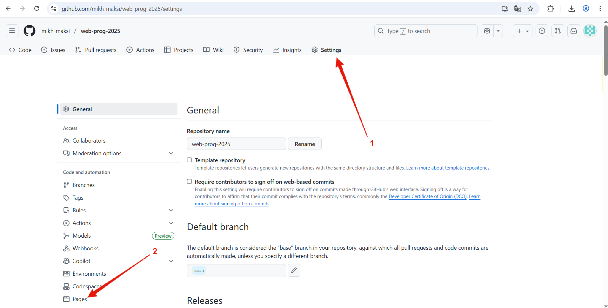
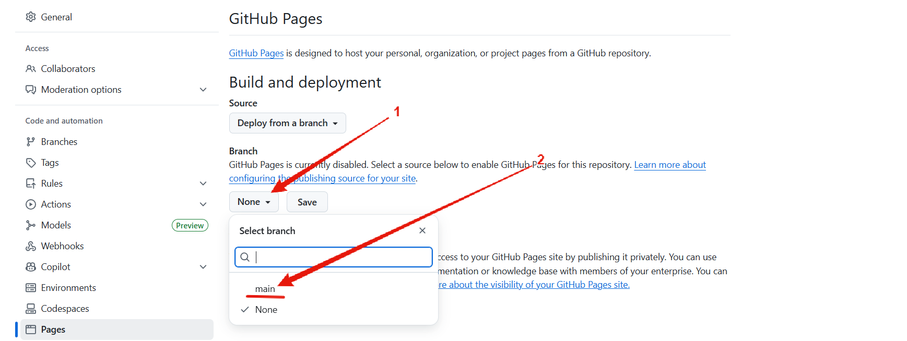
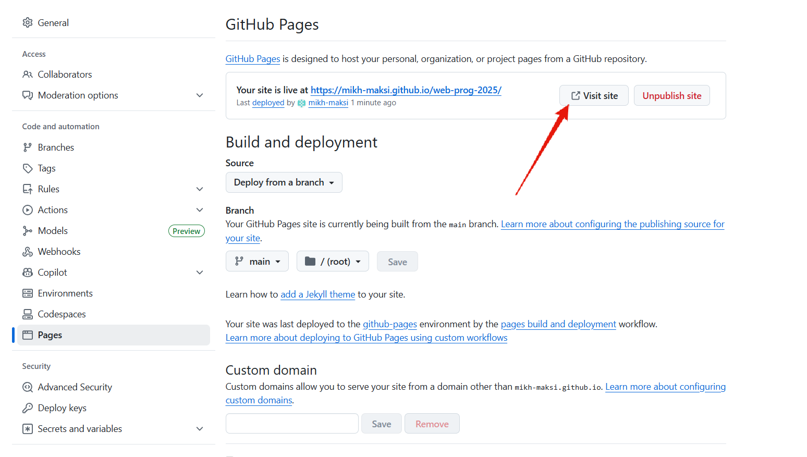
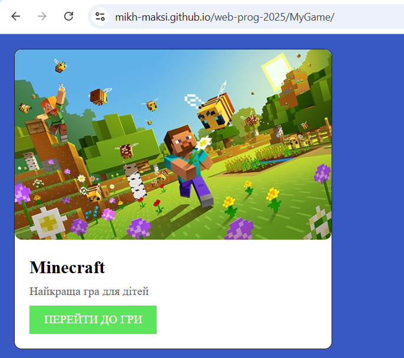
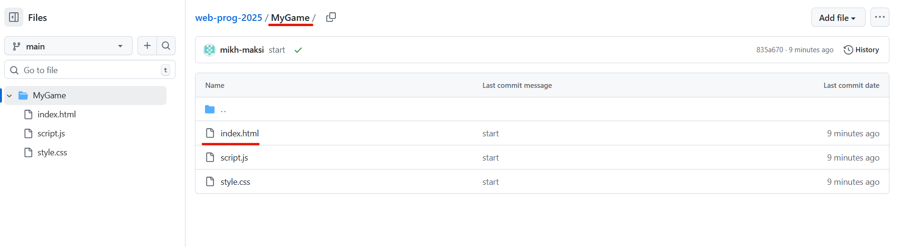

# Створення сайту на GitHub Pages
## Захоимо до розділу Settings/Pages  
  

## Обираємо джерело даних. Для цього оберемо гілку (branch) яка використовується за замовчуванням (main). І зберіжу зміни.
  

## Через приблизно хвилину при оновленні даної сторінки GitHub вам надасть посилання на сайт, який пов'язаний із вашим репозиторієм.  
  

## Перейдя за цим посиланням ви зможете побачити запущений HTML+CSS+JS код.  
  

## Код знаходиться у вашому репозитарію.  
  
